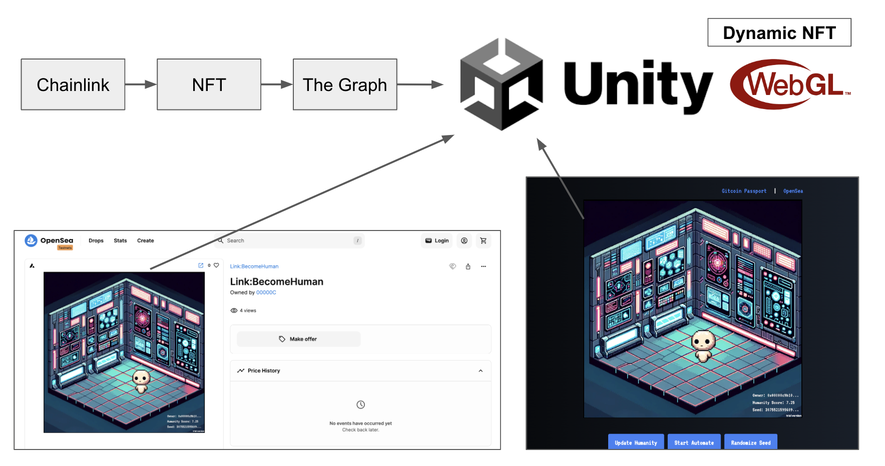

# Link: Become Human

Dynamic NFT that utilizes Chainlink VRF, Chainlink Functions, and Chainlink Automation. It leverages the Gitcoin Passport's humanity score to show an android's transformation into a human within the NFT.

## Live App

https://link-become-human.vercel.app/

## Demo Video

https://youtu.be/bzFmTV1zfTk

## Technical Detail

### Data Integration Diagram

The details of Chainlink integration are maintained [here](./Docs/Chainlink-Integration.md).

### Dynamic NFT with Unity

## Avalanche Integration

The dynamic NFT is deployed Avalanche C-Chain Fuji Testnet.

https://testnet.snowtrace.io/address/0x98d80C7a5338fD211544f1f807D19F9191264Ce0#code-43113

Opensea supports Avalanche C-Chain Fuji Testnet and the asset page is here.

https://testnets.opensea.io/assets/avalanche-fuji/0x98d80C7a5338fD211544f1f807D19F9191264Ce0/1098112484341563293955512077999730492067707

## The Graph Integration

The Graph is used in a Unity C# script for data aggregation.
https://github.com/taijusanagi/link-become-human/blob/main/Assets/Scripts/GameManager.cs#L122

The following subgraphs are integrated.

- https://api.studio.thegraph.com/proxy/60667/linkbecomehuman/v0.0.1/graphql (New)
- https://api.thegraph.com/subgraphs/name/ensdomains/ens/graphql (Existing one for ENS)

## ENS Integration

- The ENS name is fetched by The Graph and displayed in the dynamic NFT.
- The ENS avatar is fetched by Rainbow Kit SDK.

